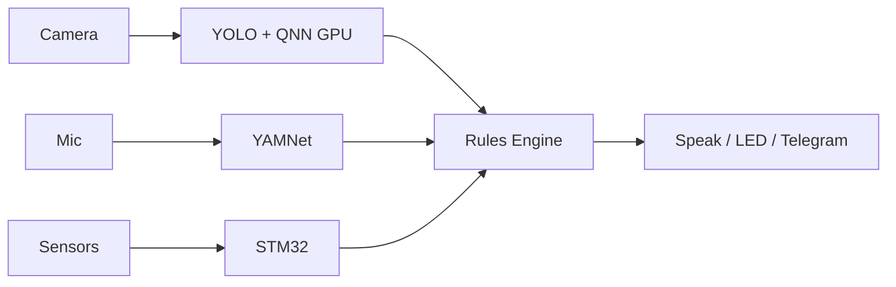

# A.W.A.R.E.

**Autonomous Witness And Response Engine** — an edge automation device that sees, hears, and responds to its environment. Built on the Arduino UNO Q ($80, Qualcomm Dragonwing QRB2210 + STM32U585).

Users type commands like `when person detected say welcome` into a web dashboard. An on-device LLM parses the intent, and a rules engine executes it — all locally, no cloud, no internet required.

## What It Does

AWARE watches a camera feed, listens for sounds, and reads physical sensors. When something happens — a person walks in, a doorbell rings, temperature spikes — it acts: speaking through a Bluetooth speaker, flashing LEDs, sending alerts.



The LLM runs on demand for three jobs: parsing "when X do Y" into rules at teach-time, narrating activity periods into summaries, and answering "what happened?" from the on-device event log. The rules engine runs those rules at 500ms intervals, independently of the LLM.

## Memory & Ask

Every perception event is logged to SQLite (`detection_enter`, `detection_exit`, `sound`, throttled `sensor:*`, `action_executed`). A background task every 5 minutes compresses recent events into a digest and stores a narrative summary. Users ask natural-language questions via the dashboard **Ask** card or `POST /api/ask`.

```
Events → SQLite → 5-min digest → LLM narrative → summaries table
                                      ↓
User asks "what happened?" → context builder → LLM answer
```

**API endpoints:** `POST /api/ask`, `GET /api/summaries`, `GET /api/sensors` (live cache), `GET /events`

Board inference for memory queries takes ~90–130s; set `AWARE_LLM_TIMEOUT=180`. See `docs/superpowers/specs/2026-07-19-memory-narration.md`.

## Use Cases

| Command | What happens |
|---|---|
| `when someone walks in after 11pm send me a message` | Camera detects person + time check → Telegram alert |
| `when temperature is above 30C and someone in the room turn on fan` | Sensor + camera AND condition → relay activates fan |
| `if abnormal vibrations and temperature rises alert me` | Accelerometer + temp spike → alarm + notification |

These show how multiple sensor inputs combine with time conditions and actions — all specified in plain English.

## Hardware

**MPU:** QRB2210 — 4x Cortex-A53 @ 1.8GHz, Adreno 702 GPU. Runs Linux, all AI inference (YOLO on GPU, LLM/audio on CPU), web server, rules engine.

**MCU:** STM32U585 — Cortex-M33 @ 160MHz. Reads Modulino sensors (temp, distance, accelerometer), controls LEDs and buzzer. Communicates with MPU via msgpack RPC over arduino-router.

**Peripherals:** USB camera, USB mic, Bluetooth speaker, Modulino sensor modules.

## AI Models

- **YOLOv8n** (ONNX, 13MB) — object detection at 2Hz. Inference runs on the **Adreno 702 GPU** via Qualcomm's QNN Execution Provider; image preprocessing (resize, color conversion) uses OpenCL. Offloads the CPU for other tasks.
- **MiniCPM5-1B Q4_K_M** (GGUF, 657MB) — parses natural language commands into rules, narrates activity, and answers memory questions. Grammar-constrained JSON output ensures valid structure every time.
- **YAMNet** (ONNX, 16MB) — sound event classification at ~4Hz mapping to 26 mapped classes (doorbell, glass break, knock, alarm, siren, dog, speech, baby cry, fire). Falls back to FFT classifier if model unavailable. Energy spike pre-filter avoids running inference on silence.
- **Piper** (ONNX) — neural text-to-speech for spoken responses. espeak-ng fallback if unavailable.

## Decisions

**YOLOv8n on QNN GPU** over CPU inference: Adreno 702 handles neural network inference via Qualcomm's AI Engine. OpenCL accelerates image preprocessing. Frees CPU cores for the rules engine, LLM, and audio.

**MiniCPM5-1B Q4_K_M** over Q8 or Phi-3-mini (3.8B): Q4 fits in 4GB RAM alongside YOLO, web server, and audio (~657MB for the LLM). Q8 exists on disk but is unused — not enough headroom. MiniCPM5 reliably follows structured output instructions.

**Grammar-constrained LLM output:** GBNF grammar forces valid JSON every time. Without it, ~30% of LLM outputs are malformed.

**Audio classification:** YAMNet ONNX (521 classes) as primary detector for robust sound event classification. FFT is fallback, not primary — better accuracy for doorbell, glass break, speech. Energy spike pre-filter avoids running inference on silence.

**SQLite:** No daemon, no port, single file. ACID with WAL mode handles concurrent reads.

**Arduino-router msgpack RPC:** The official Qualcomm bridge for MPU↔STM32 on this board. We use the platform's native inter-processor communication.

**500ms tick:** Fast enough to feel instant, slow enough to not waste CPU. Sensor cache updates every 2s; DB logs on 30s interval or significant change.

**Memory narration:** Hierarchical compression (raw events → 5-min digest → LLM narrative) keeps memory queries within 2048-token context on MiniCPM5-1B. Digest is stored as fallback when LLM is busy or unavailable.
