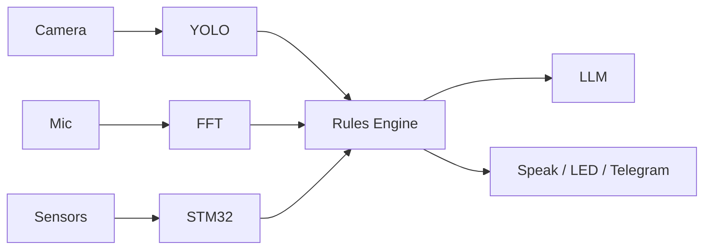

# A.W.A.R.E.

**Autonomous Witness And Response Engine** — an edge AI agent that sees, hears, and responds to its environment. Built on the Arduino UNO Q (Qualcomm Dragonwing QRB2210 + STM32U585).

Users type commands like `when person detected say welcome` into a web dashboard. An on-device LLM parses the intent, and a rules engine executes it — all locally, no cloud, no internet required.

## What It Does

AWARE watches a camera feed, listens for sounds, and reads physical sensors. When something happens — a person walks in, a doorbell rings, a bottle appears — it acts: speaking through a Bluetooth speaker, flashing LEDs, sending alerts.

The whole pipeline runs in real-time on a single $90 board:

## Examples

| Command | What happens |
|---|---|
| `when person detected say welcome` | Camera spots someone → speaker says "welcome" |
| `when person leaves say goodbye` | Person exits frame → speaker says "goodbye" |
| `when bottle detected say I'm hydrophobic` | Bottle appears → speaker makes a joke |
| `when glass breaks after 10pm sound alarm` | Audio + time check → alarm sounds |
| `when doorbell rings flash green` | Doorbell detected → LED flashes green |

## Hardware

**MPU:** QRB2210 — 4x Cortex-A53 @ 1.8GHz, Adreno 702 GPU. Runs Linux, all AI inference, web server, rules engine.

**MCU:** STM32U585 — Cortex-M33 @ 160MHz. Reads Modulino sensors (temp, distance, accelerometer), controls LEDs and buzzer. Communicates with MPU via msgpack RPC over arduino-router.

**Peripherals:** USB camera (320x240), USB mic, Bluetooth speaker (BlueALSA), Modulino sensor modules.

## AI Models

- **YOLOv8n** (ONNX, 13MB) — object detection at 2Hz. Runs on CPU via ONNX Runtime.
- **MiniCPM5-1B Q4** (GGUF, 657MB) — LLM for parsing natural language commands. Runs via llama.cpp with grammar-constrained JSON output.
- **Custom audio classifier** — FFT-based sound event detection (doorbell, glass, speech, alarm). No ML model, just spectral analysis.

## Technical Decisions

**Why YOLOv8n?** Smallest YOLO variant (3.2M params). Fits in ~100MB RAM alongside the LLM and web server. Larger models give diminishing returns for indoor detection at 3x the memory cost.

**Why MiniCPM5-1B?** One of the smallest instruction-tuned models that reliably follows structured output instructions. Phi-3-mini (3.8B) is too big for 4GB RAM with other services running.

**Why grammar-constrained LLM output?** Without it, LLMs produce invalid JSON ~30% of the time. The GBNF grammar forces output to exactly `{"name":"...", "when":"...", "then":"...", "priority":"..."}` — making the LLM reliable enough for production.

**Why not use the GPU?** The Adreno 702 has 1 compute unit. OpenCL kernel dispatch overhead may negate speedup over 4 Cortex-A53 cores for a 3.2M param model. Documented as future optimization.

**Why SQLite?** No daemon, no port, single file, ACID compliant. Handles concurrent reads with WAL mode. Perfect for embedded.

**Why 500ms tick?** Fast enough for human perception (imperceptible delay), slow enough to not waste CPU, aligned with the 2Hz sensor update rate.

**Why arduino-router + msgpack RPC?** The official Qualcomm bridge for MPU↔STM32 communication on this board. Uses the platform's native inter-processor architecture rather than a custom serial protocol.

## Dashboard

Web interface at `:8000` — live camera feed with bounding boxes, object/sound detection logs, temperature and distance charts, active workflows, command input, and full activity history. Single `index.html`, no build step.
