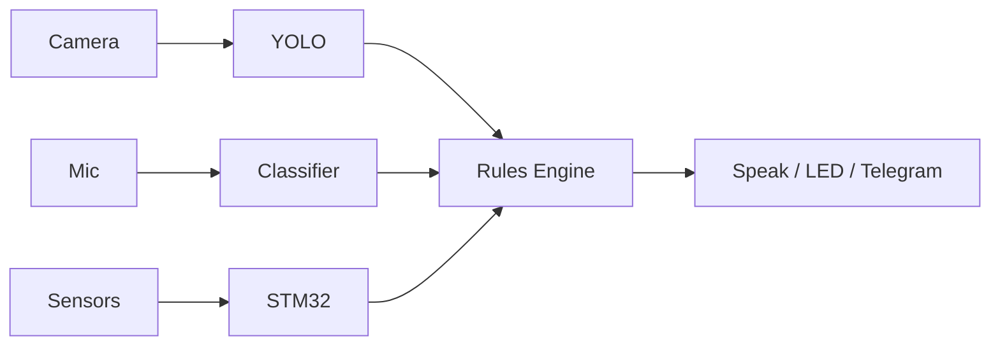

# A.W.A.R.E.

**Autonomous Witness And Response Engine** — an edge AI agent that sees, hears, and responds to its environment. Built on the Arduino UNO Q ($80, Qualcomm Dragonwing QRB2210 + STM32U585).

Users type commands like `when person detected say welcome` into a web dashboard. An on-device LLM parses the intent, and a rules engine executes it — all locally, no cloud, no internet required.

## What It Does

AWARE watches a camera feed, listens for sounds, and reads physical sensors. When something happens — a person walks in, a doorbell rings, temperature spikes — it acts: speaking through a Bluetooth speaker, flashing LEDs, sending alerts.

The LLM only runs at rule creation time — it parses "when X do Y" into structured rules. The rules engine then runs those rules at 500ms intervals, independently of the LLM.

## Use Cases

| Command | What happens |
|---|---|
| `when someone walks in after 11pm send me a message` | Camera detects person + time check → Telegram alert |
| `when temperature is above 30C and someone in the room turn on fan` | Sensor + camera AND condition → relay activates fan |
| `if abnormal vibrations and temperature rises alert me` | Accelerometer + temp spike → alarm + notification |

These show how multiple sensor inputs combine with time conditions and actions — all specified in plain English.

## Hardware

**MPU:** QRB2210 — 4x Cortex-A53 @ 1.8GHz. Runs Linux, all AI inference, web server, rules engine.

**MCU:** STM32U585 — Cortex-M33 @ 160MHz. Reads Modulino sensors (temp, distance, accelerometer), controls LEDs and buzzer. Communicates with MPU via msgpack RPC over arduino-router.

**Peripherals:** USB camera, USB mic, Bluetooth speaker, Modulino sensor modules.

## AI Models

- **YOLOv8n** (ONNX, 13MB) — object detection at 2Hz. CPU inference via ONNX Runtime.
- **MiniCPM5-1B Q4** (GGUF, 657MB) — parses natural language commands into rules. Grammar-constrained JSON output ensures valid structure every time.
- **Audio classifier** — YAMNet ONNX (521 sound classes, 16MB) running at ~4Hz. Falls back to lightweight FFT classifier if model unavailable. Mapped 27 relevant classes (doorbell, glass, knock, alarm, siren, dog, speech, baby cry, fire).

## Decisions

**YOLOv8n** over larger models: 3.2M params fits in ~100MB RAM alongside the LLM. Bigger models cost 3-4x more memory for marginal accuracy gains indoors.

**MiniCPM5-1B** over Phi-3-mini (3.8B): too big for 4GB RAM with everything else running. MiniCPM5 follows structured output instructions reliably.

**Grammar-constrained LLM output:** GBNF grammar forces valid JSON every time. Without it, ~30% of LLM outputs are malformed.

**Audio classification:** YAMNet ONNX (521 classes) for robust sound detection. FFT fallback if model unavailable. Energy spike pre-filter avoids running inference on silence.

**SQLite:** No daemon, no port, single file. ACID with WAL mode handles concurrent reads.

**Arduino-router msgpack RPC:** The official Qualcomm bridge for MPU↔STM32 on this board. We use the platform's native inter-processor communication.

**500ms tick:** Fast enough to feel instant, slow enough to not waste CPU. Aligned with 2Hz sensor updates.
